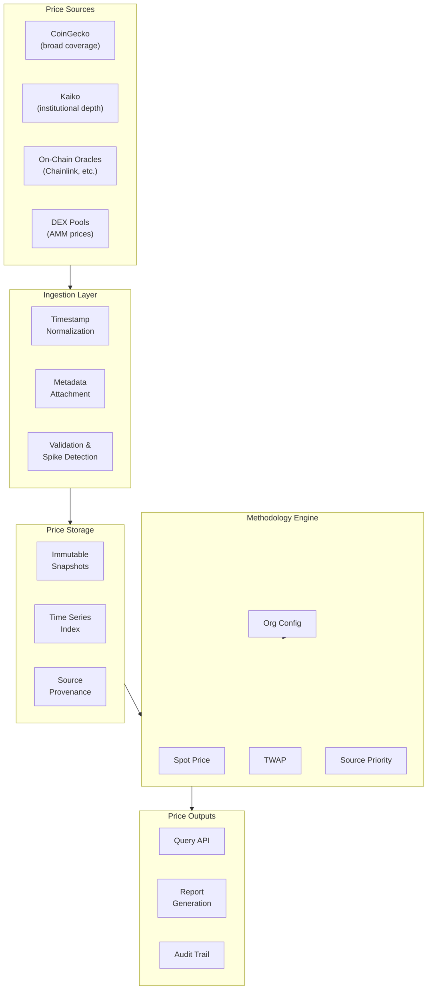

export const frontmatter = {
  title: "Accurate Multi-Source Crypto Pricing Infrastructure for Accounting and Financial Reporting",
  slug: "crypto-pricing",
  date: "2026-01-31",
  status: "published",
  tags: ["crypto-pricing", "accounting", "market-data", "financial-infra", "reconciliation", "audit"],
  image: "/work/crypto-pricing.webp"
}

# Accurate Multi-Source Crypto Pricing Infrastructure for Accounting and Financial Reporting

## The Problem at Scale

"What's the price?" should be a simple question. In crypto, it's not.

At Coinshift, managing treasury infrastructure for 300+ organizations with $1B+ in assets, pricing disputes became a constant source of friction. Finance teams would export their portfolio, apply prices from CoinGecko, and generate reports. Then an auditor would check the same portfolio using Kaiko prices and get different numbers. Or a tax accountant would use a different timestamp convention and arrive at yet another valuation.

The fundamental problem: there is no single authoritative price source for crypto assets. Different providers have different coverage, different latency, different methodologies, and different handling of edge cases. A token might have a price on CoinGecko but not Kaiko, or vice versa. Prices from the same provider at the "same" time can differ due to API latency and aggregation windows. Illiquid tokens can have prices spiked by tiny trades that don't reflect real market value.

Traditional finance solved this decades ago with standardized exchange feeds, consolidated tape requirements, and regulatory frameworks defining "official" prices. Crypto has none of this. And organizations expecting institutional-grade financial reporting need infrastructure that can bridge this gap.

---

## Why Standard Approaches Fail

### Single-Vendor Dependency

The first instinct is to pick one vendor—usually CoinGecko for breadth or Kaiko for institutional depth—and treat their prices as truth.

This fails on coverage. No single vendor covers all tokens. CoinGecko has broad coverage but limited historical depth for newer tokens. Kaiko has excellent institutional data but doesn't cover every DeFi token. When your organization holds a long-tail token that your vendor doesn't price, what do you report? Zero? Last known price? Estimated value? Each choice creates compliance risk.

It also fails on resilience. Vendor APIs go down. Rate limits get hit. Data gets delayed. A single-vendor dependency means your reporting pipeline stops when they have issues.

### Multiple Vendors with Simple Fallback

The next attempt is adding fallback sources: try CoinGecko first, if unavailable try Kaiko, then try on-chain oracles.

This creates consistency problems. Different sources report prices at different timestamps with different aggregation methodologies. Simply falling back to "whatever is available" means the same asset gets priced differently depending on which source responded first. Historical reports become non-reproducible—running the same query tomorrow might hit different sources and produce different results.

### Averaging Across Sources

Some systems try to average prices across multiple sources to get a "consensus" price.

This sounds reasonable but fails in practice. What if one source has stale data? You're averaging current prices with stale prices. What if one source has a manipulation-induced spike? You're averaging real prices with manipulated prices. What about tokens that only exist on one source? The average of one data point is that data point, but now you've added false precision by calling it a "multi-source average."

---

## The Architecture We Built

We built a methodology-aware pricing engine that aggregates multiple sources while preserving the transparency and reproducibility needed for financial reporting.

### Multi-Source Ingestion with Source Metadata

Every price point we ingest carries full metadata:
- Source identifier (CoinGecko, Kaiko, on-chain oracle, etc.)
- Source timestamp (when the source reported the price)
- Ingestion timestamp (when we received it)
- Methodology tag (spot, TWAP, VWAP, last trade, etc.)
- Confidence indicators (liquidity depth, trade recency)

This metadata isn't discarded—it's preserved and queryable. When a report uses a price, the audit trail shows exactly which source provided it, when, and using what methodology.

### Methodology-Aware Price Selection

Different accounting standards and use cases require different pricing approaches:

- **Spot price**: Last known price at the query timestamp. Simple but sensitive to timing.
- **TWAP (Time-Weighted Average Price)**: Average over a time window. Smooths volatility but requires defining the window.
- **VWAP (Volume-Weighted Average Price)**: Weighted by trading volume. Better reflects "market" price but requires volume data.
- **Source-priority**: Hierarchical preference—use Kaiko if available, else CoinGecko, else on-chain.

The pricing engine doesn't hardcode one approach. Organizations configure their methodology preferences, and the engine applies them consistently. A GAAP-compliant report might use spot prices at end-of-day. An internal treasury dashboard might use TWAP for stability. Both use the same underlying data with different selection rules.

### Timestamp Alignment Layer

Different sources have different timestamp semantics. CoinGecko aggregates prices over intervals. Kaiko provides tick-level data. On-chain oracles update at irregular intervals based on price deviation thresholds.

We built an alignment layer that normalizes these into a consistent time domain. When you query "price at time T," the system:
1. Identifies the relevant data points from each source (closest before T, closest after T)
2. Applies interpolation or selection rules based on configured methodology
3. Returns a price with full provenance showing exactly how it was derived

This means cross-source queries are meaningful. "What was the CoinGecko price vs. Kaiko price at 3:47 PM UTC?" returns comparable values even though the sources have different native timestamp granularities.

---

## Architectural Decisions

<table>
  <thead>
    <tr>
      <th>Decision</th>
      <th>Alternatives Considered</th>
      <th>Why This Choice</th>
    </tr>
  </thead>
  <tbody>
    <tr>
      <td>Multi-source with methodology-aware selection</td>
      <td>Single authoritative source</td>
      <td>No single source covers all assets reliably; different use cases require different methodologies</td>
    </tr>
    <tr>
      <td>Preserve source metadata with every price</td>
      <td>Store only "final" price</td>
      <td>Audit requires traceability; debugging requires knowing which source was used</td>
    </tr>
    <tr>
      <td>Timestamp alignment layer</td>
      <td>Trust provider timestamps directly</td>
      <td>Providers have clock drift and different aggregation windows; cross-source queries need consistent time domain</td>
    </tr>
    <tr>
      <td>Immutable price snapshots at ingestion</td>
      <td>Re-fetch historical data as needed</td>
      <td>Providers sometimes revise historical data; audit requires knowing what was known at decision time</td>
    </tr>
    <tr>
      <td>Configurable methodology per organization</td>
      <td>One-size-fits-all pricing</td>
      <td>Different accounting standards (GAAP, IFRS) and use cases require different approaches</td>
    </tr>
  </tbody>
</table>

---

## Hard Problem Deep Dives

### Illiquid Token Price Spikes

Low-liquidity tokens can have prices spiked by small trades. A $1,000 buy order on a token with minimal liquidity can move the price 10x. This isn't market manipulation necessarily—it's just the mechanics of thin order books. But if your pricing system reports that spike as the token's value, your portfolio valuation is now wildly incorrect.

We built spike detection into the pricing pipeline. The system tracks:
- Historical price distribution for each token
- Recent trading volume relative to circulating supply
- Cross-source price agreement (do all sources show the spike, or just one?)

When a price point is statistical outlier and comes from a low-confidence source (low volume, single exchange), it gets flagged. The system can either exclude it entirely or fall back to alternative sources. Organizations can configure their tolerance for outliers based on their risk appetite.

The tricky part is distinguishing real price moves from manipulation spikes. A 10x move in a major token is news; a 10x move in a token with $500 daily volume is probably noise. We use relative metrics—price change relative to historical volatility, volume relative to historical volume—rather than absolute thresholds.

### Oracle Lag During Volatility

On-chain price oracles (Chainlink, etc.) don't update continuously. They update when price moves exceed a threshold or when a heartbeat interval passes. During high volatility, oracle prices can lag market prices significantly.

This matters for organizations that need to reconcile on-chain valuations with off-chain reports. A lending protocol might liquidate a position based on oracle prices while market prices have already recovered. A treasury report might show different values depending on whether it uses oracle or market data.

We built latency-aware source selection. Each source has a latency profile that we track empirically—how often does this source lag the market by more than X%? During detected high-volatility periods, the system automatically adjusts source preferences to favor lower-latency feeds.

Organizations can also configure explicit rules: "For real-time dashboards, prefer market data. For on-chain reconciliation, use oracle prices regardless of lag." The system applies these rules consistently and documents which rule was active for each price point.

### Historical Price Reproducibility

Pricing vendors sometimes revise historical data. They fix errors, adjust for corporate actions, or improve their aggregation methodology. This is good for data quality but terrible for audit reproducibility. If your 2024 Q4 report used CoinGecko prices that CoinGecko later revised, your report is now non-reproducible.

We solved this with immutable snapshots at ingestion time. When we receive a price from a vendor, we snapshot it with an immutable timestamp. Our historical queries use our snapshots, not the vendor's current view of history.

This creates a "known-at" vs. "true-as-of" distinction. "What did we think the price was when we generated the Q4 report?" (known-at) is different from "What does the vendor now say the price was?" (true-as-of). Both are valid questions; audit needs the former.

We also track when vendors revise data, so organizations can choose whether to accept revisions or maintain their original values. Most choose to maintain original values for closed periods and accept revisions only for current/future periods.

---

## Multi-Source Price Aggregation

---

## Accounting Methodology Support

Different accounting standards require different pricing approaches. Our system supports the methodologies organizations actually need:

### Fair Value (GAAP/IFRS)
- Uses active market prices where available
- Falls back to valuation models for illiquid assets
- Supports Level 1/2/3 fair value hierarchy classification

### Mark-to-Market
- End-of-period spot prices
- Configurable end-of-day timestamp (organizations operate in different timezones)
- Supports different granularities (daily, monthly, quarterly marking)

### Tax Basis
- FIFO, LIFO, or specific identification for cost basis
- Tracks acquisition price at transaction time
- Handles same-day acquisitions and disposals correctly

### Internal Reporting
- TWAP for reduced volatility exposure
- Custom source priorities based on organizational preferences
- Real-time vs. settlement-time price options

Each methodology is implemented as a configuration layer over the same underlying price data. Switching methodologies doesn't require re-ingesting data—just re-running selection logic with different parameters.

---

## Production Outcomes

### Technical Outcomes
- Multi-source pricing aggregation across CoinGecko, Kaiko, and on-chain oracles
- Methodology-aware price selection supporting spot, TWAP, VWAP, and custom rules
- Immutable historical snapshots with full source provenance
- Sub-second price query latency across all supported assets

### Operational Outcomes
- Eliminated pricing disputes—audit trails show exactly which source and methodology produced each price
- Finance teams could switch accounting methodologies without re-building reports
- Pricing gaps filled through systematic fallback hierarchy

### Business Outcomes
- Audit-ready pricing history with reproducible historical state
- Support for multiple accounting standards (GAAP, IFRS) in the same system
- Reduced reliance on any single vendor for pricing data

---

## Scale Context

- Pricing data for thousands of tokens across multiple sources
- Millions of historical price points with full provenance
- $1B+ in assets valued using this infrastructure
- 300+ organizations with varying methodology requirements
- Multiple accounting standards supported simultaneously

---

## Lessons Learned

**No single source is sufficient.** Every vendor has coverage gaps, latency issues, and methodology quirks. Multi-source isn't just redundancy—it's correctness.

**Methodology transparency matters more than methodology choice.** Auditors don't necessarily care whether you use TWAP or spot pricing. They care that you can explain exactly how you arrived at a number and reproduce it.

**Historical reproducibility is harder than it sounds.** Vendors revise data. APIs change. The price you got yesterday might not be the price you get if you query again. Immutable snapshots at ingestion time are the only reliable solution.

**Different users need different prices.** A CFO wants stability for financial planning. A trader wants real-time accuracy. A tax accountant wants regulatory compliance. One pricing system needs to serve all these users with appropriate methodology options.

---

## Related Technical Deep Dives

For how priced assets feed into treasury state:
- [Multi-Chain Treasury Infrastructure for Crypto Organizations](/work/multi-chain-treasury)
