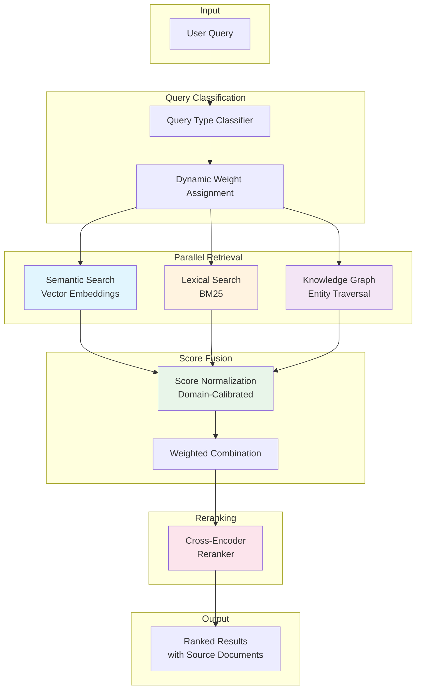

export const frontmatter = {
  title: "Hybrid Retrieval Architecture for High-Accuracy Technical Documentation AI",
  slug: "hybrid-retrieval",
  date: "2025-12-16",
  status: "published",
  tags: ["rag", "hybrid-retrieval", "vector-search", "knowledge-graphs", "technical-ai"],
  industry: "aerospace / manufacturing / industrial",
  domain: "technical document intelligence",
  tech: "embeddings, bm25, knowledge graph retrieval, reranking",
  image: "/work/hybrid-retrieval.webp"
}

# Hybrid Retrieval Architecture for High-Accuracy Technical Documentation AI

## The Engagement

An aerospace MRO provider came to us with a problem that was costing them hours of technician time every day. Their maintenance documentation—fault isolation guides, repair procedures, parts catalogs, safety bulletins—was scattered across multiple systems. Technicians searching for a specific procedure might query three different databases, wade through irrelevant results, and still not be confident they had the right document.

The immediate pain was productivity. But the deeper concern was safety. When a technician retrieves the wrong fault isolation procedure or misses a safety advisory update, the consequences aren't measured in hours—they're measured in aircraft on ground, missed airworthiness requirements, and potential incidents.

They had tried conventional search. Keyword search found exact matches but missed conceptual relationships. A technician searching for "hydraulic system overheating during taxi" wouldn't find the procedure indexed under "HYD-SYS-TEMP-ELEV-GND-OPS." They had also piloted a vector search solution, which handled natural language beautifully—until someone needed to find part number 74A2847-103, and the semantic model returned results for similar-looking but functionally different components.

Neither approach worked alone. They needed both.

---

## What They Needed

The requirements emerged through several weeks of working with their engineering and maintenance leadership:

**Exact identifier matching must be reliable.** Part numbers, procedure IDs, ATA chapter references, and document revision numbers cannot be approximated. When a technician searches for "AMM 32-42-00," the system must return that specific section—not semantically similar content about landing gear.

**Conceptual queries must also work.** "Why does the APU auto-shutdown during ground operations in high ambient temperatures?" is a valid query that requires semantic understanding. The answer might be spread across multiple documents that never use those exact words.

**Cross-document reasoning is required.** A fault isolation procedure might reference a component, which has a parts list, which has a safety bulletin affecting certain serial numbers. Following these relationships manually is error-prone and slow.

**No hallucinated safety information.** In technical documentation, a confident-sounding wrong answer is worse than no answer. The system must surface relevant source documents, not generate plausible-sounding responses from thin air.

**Predictable query latency under load.** When twenty technicians are querying the system during a line maintenance push, response times cannot degrade unpredictably.

---

## The Technical Solution

We built a hybrid retrieval architecture that combines three distinct retrieval methods, unified through a calibrated ranking pipeline.

The diagram above shows the query flow: incoming queries are classified to determine retrieval method weights, then executed in parallel across semantic, lexical, and knowledge graph retrieval. Results are normalized to comparable scales, combined, and optionally reranked for maximum precision.

### Why Hybrid Over Single-Mode Retrieval

The core architectural decision was to run multiple retrieval strategies in parallel rather than choosing one approach.

We considered vector-only retrieval. Modern embedding models are impressive, but they fundamentally encode semantic similarity—they find documents that mean similar things. Technical identifiers don't have "meaning" in the semantic sense. The embedding for "74A2847-103" and "74A2847-104" will be nearly identical, even though they're different parts with potentially critical differences in application.

We considered BM25-only retrieval. Lexical matching excels at exact identifiers but fails completely on conceptual queries. It cannot understand that "hydraulic overheat" and "HYD-SYS-TEMP-ELEV" refer to the same condition.

We chose to run both methods on every query, then combine their results through a calibrated ranking layer.

### Adding Knowledge Graph Retrieval

Vector and lexical search both operate on document chunks in isolation. But technical documentation is deeply relational. A fault isolation procedure references a component, which appears in a parts list, which has applicable serial number ranges, which may have associated service bulletins.

We added knowledge graph retrieval as a third method. During document ingestion, we extract entities—components, procedures, part numbers, document references—and their relationships. At query time, we expand the initial retrieval results by traversing these relationships.

We considered skipping the knowledge graph entirely. It adds significant ingestion complexity and storage overhead. But when we tested the system without it, we found that technicians often asked questions that required connecting information across documents. "What service bulletins affect the APU controller on aircraft with serial numbers above 500?" requires graph traversal—it cannot be answered by semantic similarity alone.

### Cross-Encoder Reranking

After combining results from all three retrieval methods, we add an optional reranking stage using a cross-encoder model.

We considered trusting the initial ranking. Cross-encoders add latency—they must score each candidate document pair individually rather than using pre-computed embeddings. But for mission-critical queries where precision matters more than speed, the latency cost is justified. We made reranking configurable per query, allowing the system to balance speed and precision based on the query context.

### Score Normalization Across Methods

This was harder than it sounds. Vector similarity scores, BM25 scores, and graph traversal weights have completely different distributions. A BM25 score of 15 and a cosine similarity of 0.87 cannot be meaningfully compared.

Naive combination—just adding the scores together—produces nonsense rankings. A document with a moderate BM25 match and a moderate semantic match might score higher than a document with an excellent exact identifier match, simply because the score distributions differ.

We implemented domain-calibrated normalization. We collected representative queries across different query types—identifier lookups, conceptual questions, troubleshooting scenarios—and calibrated the score distributions for each retrieval method against human relevance judgments. The normalization transforms each method's scores into a comparable range before combination.

---

## Hard Problems We Navigated

### Knowledge Graph Construction from Technical Prose

Standard named entity recognition models are trained on news articles and general text. They recognize person names, organizations, and locations. They do not recognize that "the No. 2 hydraulic system pressure transmitter" is a component entity, or that "refer to AMM 32-42-11" is a document reference relationship.

We built custom entity extraction pipelines tuned for technical language structure. This required understanding the conventions of S1000D documentation, ATA chapter numbering, and the implicit relationships embedded in maintenance procedure prose. "After completing the preceding steps, verify correct operation per the aircraft maintenance manual" contains an implicit cross-reference that a general-purpose NER model would miss entirely.

### Query-Type-Aware Weighting

Not all queries should weight retrieval methods equally. "What's the torque spec for bolt X?" needs lexical weight—there's a specific identifier to match. "Why is the system overheating?" needs semantic weight—the answer requires conceptual understanding.

We implemented dynamic query classification and routing. The system analyzes incoming queries to determine their type—identifier lookup, conceptual question, troubleshooting scenario, cross-reference request—and adjusts the retrieval method weights accordingly. This isn't a simple keyword detector; it's a lightweight classifier trained on representative query patterns from the technical documentation domain.

### Maintaining Retrieval Precision at Scale

As the document corpus grows, retrieval quality can degrade. More documents mean more candidates, which means more opportunities for marginally relevant results to crowd out precisely relevant ones.

We implemented tiered retrieval with early filtering. The first stage uses fast approximate methods to identify candidate documents. Only candidates passing relevance thresholds proceed to the more expensive reranking stage. This maintains predictable latency while preserving precision.

---

## Tradeoffs We Made

**Complexity over simplicity.** A hybrid architecture is inherently more complex than single-mode retrieval. There are more components to monitor, more failure modes to handle, more configuration to tune. We accepted this complexity because the accuracy requirements justified it.

**Ingestion latency for query quality.** Building knowledge graphs and maintaining multiple indices means documents take longer to become searchable after upload. We optimized the ingestion pipeline but accepted that this system would never match the speed of a simple full-text index.

**Per-domain calibration required.** The score normalization and query classification require calibration data from the target domain. This system cannot be deployed out-of-the-box to an arbitrary document corpus without tuning. We accepted this because generic solutions don't achieve the accuracy required for safety-critical documentation.

---

## What Shipped

The hybrid retrieval system went into production serving their maintenance documentation library—several thousand documents covering multiple aircraft platforms.

### Technical Outcomes

Retrieval precision improved substantially on queries involving technical identifiers while maintaining accuracy on conceptual queries. The previous keyword-only system would return dozens of marginally relevant results; the hybrid system surfaces the specific procedures technicians need.

Multi-document reasoning became practical. Queries that previously required technicians to manually trace references across documents now surface connected information automatically.

Hallucinated context was eliminated. The system retrieves and surfaces source documents rather than generating answers. Technicians see exactly which documents support each response and can verify accuracy against authoritative sources.

### Business Outcomes

Average time to locate correct procedures decreased. This translates directly to technician productivity during maintenance operations.

Confidence in retrieved results increased. Technicians reported that they trusted the system's top results rather than manually verifying against multiple sources—a significant workflow improvement.

The system enabled junior technicians to work more independently. Access to reliably accurate documentation reduced the need for senior technician consultation on routine queries.

---

## Lessons From This Work

Technical documentation is fundamentally different from general knowledge text. It requires retrieval systems designed for its specific characteristics: precise identifiers, structured relationships, safety-critical accuracy requirements.

Hybrid approaches add complexity, but that complexity is justified when query accuracy directly impacts operational outcomes. The question isn't whether hybrid retrieval is more complex—it is. The question is whether the accuracy improvement justifies the complexity cost. For safety-critical technical documentation, it does.

Score normalization is not an afterthought. Combining multiple retrieval methods without calibrated normalization produces results that look plausible but don't actually reflect document relevance. This calibration work is invisible to end users but essential to system quality.

---

## Where This Approach Applies

This architecture pattern is relevant for organizations with similar documentation characteristics:

- Aerospace maintenance and engineering documentation
- Industrial equipment technical manuals
- Medical device documentation with precise identifier requirements
- Defense technical publications with cross-reference structures
- Safety-critical systems with compliance documentation requirements

If your technical documentation has both precise identifiers and conceptual content, if accuracy matters more than speed, and if cross-document relationships carry important information—a hybrid retrieval architecture is worth the investment.
