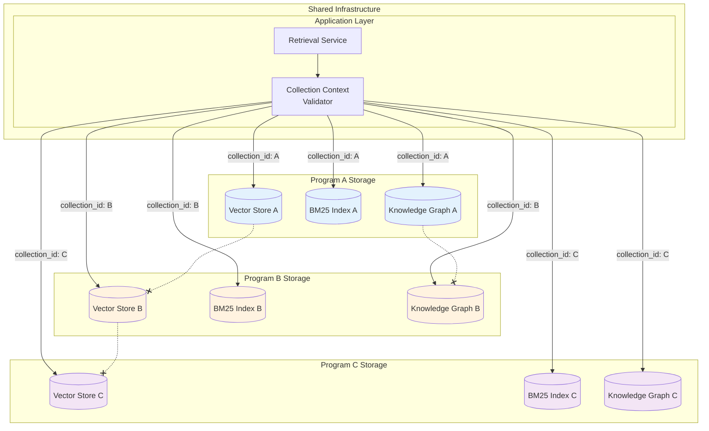

export const frontmatter = {
  title: "Architecture-Driven Multi-Tenant Knowledge Isolation for Sensitive Programs",
  slug: "knowledge-isolation",
  date: "2025-12-16",
  status: "published",
  tags: ["multi-tenant", "secure-architecture", "rag", "data-isolation", "enterprise-ai"],
  industry: "defense / aerospace / enterprise",
  domain: "secure data architecture",
  tech: "vector db isolation, namespace security, hybrid indexing"
}

# Architecture-Driven Multi-Tenant Knowledge Isolation for Sensitive Programs

## The Engagement

A defense systems integrator came to us with an infrastructure challenge that had no good off-the-shelf solution. They ran multiple classified programs simultaneously—different aircraft systems, different classification levels, different customer organizations—all needing document intelligence capability. And they needed to run these programs on shared infrastructure.

The problem wasn't lack of demand for AI-powered documentation search. Every program team wanted it. The problem was that deploying separate infrastructure for each program was operationally and economically unsustainable. They were already managing dozens of isolated environments, each with its own servers, its own maintenance burden, its own compliance audit surface.

But consolidating onto shared infrastructure created an unacceptable risk. What happens if a query from Program A accidentally returns documents from Program B? What happens if an indexing bug mixes embeddings across programs? What happens if a caching layer serves the wrong context to the wrong user?

In their environment, cross-program data exposure wasn't just a compliance violation—it was potentially a security incident requiring notification, investigation, and remediation. Even accidental leakage could have serious consequences.

They had evaluated commercial multi-tenant platforms. The vendors promised data isolation through metadata filters, access control checks, and query-time enforcement. But when they asked "how do we prove to an auditor that Program A's data cannot appear in Program B's queries?", the answers were unsatisfying. "Our filters are tested extensively." "We have SOC 2 certification." "No customer has ever reported a cross-tenant issue."

None of these answers demonstrated architectural impossibility. And for their compliance requirements, "it hasn't happened yet" was not the same as "it cannot happen."

---

## What They Needed

The requirements emerged from both technical leadership and compliance teams:

**Data from Program A must be architecturally impossible to access from Program B.** Not filtered at query time. Not blocked by access control. Actually, structurally, impossible to retrieve—because the data exists in completely separate storage with no cross-program access path.

**Compliance audits must be simple.** Their compliance teams spent significant effort on every audit, explaining how logical filters prevented cross-program access, walking through access control configurations, demonstrating that tests showed no leakage. They wanted audits where the answer was obvious: "Program A's data is in this storage. Program B's data is in that storage. There is no connection between them."

**Deletion must be complete and verifiable at namespace level.** When a program ends or a customer relationship terminates, all associated data must be removed. Not marked as deleted. Not filtered from queries. Actually removed from storage, with the ability to demonstrate that removal to auditors.

**Shared infrastructure cost benefits without shared data risk.** The business case required running multiple programs on shared compute and networking infrastructure. The security requirement demanded that sharing infrastructure not mean sharing data access paths.

---

## The Technical Solution

We built a multi-tenant document intelligence platform where isolation is enforced by architecture, not by application logic.

The diagram above shows the isolation model. Each program has completely dedicated storage—separate vector stores, separate keyword indices, separate knowledge graphs. The crossed connections between program storage represent the architectural impossibility of cross-program data access. Every query must explicitly specify its collection context, and the retrieval service can only access the storage for that specific collection.

### Physical Isolation Over Logical Filtering

The fundamental architectural decision was to reject filter-based multi-tenancy entirely.

In typical multi-tenant systems, all data goes into shared storage with tenant identifiers attached. Queries include a tenant filter, and the system returns only records matching that filter. This is efficient—shared indices, shared caches, shared infrastructure. It's also fragile. Filters can have bugs. Filters can be misconfigured. Filters can be accidentally omitted.

We considered metadata filtering as the primary isolation mechanism. It's the standard pattern, well-understood, with plenty of vendor support. But filter-based isolation fails silently. If a filter has a bug, queries succeed—they just return wrong data. There's no error, no alert, no indication that isolation has been breached.

We chose physical isolation instead. Each program gets dedicated storage:

- A dedicated vector database collection
- A dedicated BM25 keyword index
- A dedicated knowledge graph namespace

There is no shared index that could accidentally return cross-program data. The storage for Program A and Program B are separate systems that share no data paths.

### Per-Collection Dedicated Storage

Each document collection represents a hard security boundary. When a new program onboards, we provision dedicated storage resources—not a new tenant ID in a shared database, but actual separate storage instances.

We considered shared indices with tenant tags as a compromise. This would allow more efficient resource utilization—embeddings from all programs in a single vector index, with tenant metadata for filtering. But shared indices create audit complexity. How do you prove that an embedding from Program A cannot appear in a neighbor search for Program B? The technical answer involves explaining approximate nearest neighbor algorithms, index partitioning, and filter application timing. The simple answer with dedicated storage: "Program B's queries go to Program B's index. Program A's embeddings are not in that index."

The resource overhead of dedicated storage is real. More indices mean more memory, more disk, more operational surface. We accepted this overhead because the isolation guarantee was worth more than the efficiency loss.

### Explicit Collection Context on Every Query

Even with dedicated storage, application-layer bugs could theoretically merge contexts. A coding error could query the wrong collection. A session management bug could associate a user with the wrong program context.

We implemented defense-in-depth at the service boundary. Every retrieval request must explicitly specify a collection ID. There is no "default collection" behavior. There is no session-inferred context that could be wrong. Every query explicitly declares its boundary, and the retrieval service validates that the requesting user has access to that specific collection.

We considered implicit context from user sessions. It would be more convenient—users wouldn't need to explicitly select their program context for every query. But implicit context creates opportunities for errors. A user switching between programs might submit a query in the wrong context. A session timeout and re-authentication might restore the wrong default. Explicit context on every request eliminates this class of bugs.

### Namespace-Based Deletion

Deletion in multi-tenant systems is notoriously difficult. In a shared index, deleting a tenant's data means finding and removing every record with that tenant's ID. If you miss records, data persists after it should be gone. If the index doesn't support efficient deletion, removing a tenant might require rebuilding the entire index.

With namespace-based isolation, deletion is trivial and verifiable. Removing a program's data means deleting that program's storage namespace. The vector collection is dropped. The keyword index is removed. The knowledge graph partition is deleted. There's no need to scan for records—the entire namespace disappears.

This matters enormously for compliance. When an auditor asks "prove this program's data has been deleted," the answer is simple: the storage namespace no longer exists. There's nothing to scan, nothing to filter, nothing to verify at the record level.

---

## Hard Problems We Navigated

### Index Lifecycle Orchestration at Scale

With dedicated storage per collection, we needed to manage potentially hundreds of separate indices. Each collection requires provisioning, monitoring, backup, and eventual decommissioning.

Standard database operations don't handle this well. Creating a new vector collection, initializing its embedding model configuration, setting up the corresponding BM25 index, provisioning the knowledge graph namespace—this is a multi-step orchestration workflow that must execute reliably and consistently.

We built purpose-built orchestration tooling for collection lifecycle management. New program onboarding follows a defined sequence: provision vector storage, configure embedding parameters, create keyword index, initialize graph namespace, set up monitoring, register in access control. Decommissioning follows the inverse sequence with verification at each step.

### Resource Efficiency with Hard Isolation

Isolation has overhead. Dedicated indices for each collection consume more memory than a single shared index would. Running separate storage processes for each program uses more compute than a consolidated database.

We implemented dynamic provisioning strategies to balance resource usage with isolation requirements. Collections with high query volume get more resources allocated. Collections that are rarely accessed can be partially unloaded from memory. The system monitors usage patterns and adjusts resource allocation accordingly.

This doesn't eliminate the overhead of isolation—it manages it. The goal was making isolation sustainable for the number of programs they needed to support, not eliminating all efficiency costs.

### Preventing Context Merger at Service Boundaries

Even with fully isolated storage, service-layer bugs could potentially merge contexts. A caching layer that doesn't respect collection boundaries. A logging system that accidentally includes cross-collection data. A response serialization bug that mixes results.

We enforced strict boundary isolation throughout the service architecture. Caches are partitioned by collection. Logs never include document content—only metadata and collection identifiers. Response handlers validate that every returned document belongs to the requested collection before serialization.

This required review of every component that handles document data. The storage was isolated by design, but we needed to verify that the service layers between storage and users didn't inadvertently create cross-collection paths.

---

## Tradeoffs We Made

**Resource efficiency for auditability.** Shared indices would use less memory and storage. We chose isolation because the audit simplicity was worth the resource overhead. Explaining to compliance teams that "the data is in separate storage" is dramatically simpler than explaining filter-based isolation mechanisms.

**Operational complexity for security confidence.** Managing hundreds of separate collections is more operationally complex than managing a single multi-tenant database. We built tooling to manage this complexity because the security model demanded it.

**Flexibility for predictability.** A filter-based system could easily support ad-hoc cross-program queries if requirements changed. Our architecture makes cross-program queries structurally impossible. This is a feature for their security requirements, but it means that legitimate cross-program analysis would require explicit data sharing procedures rather than simple query modifications.

---

## What Shipped

The multi-tenant platform deployed supporting multiple classified programs on shared infrastructure.

### Technical Outcomes

Zero cross-collection data leakage—verified through both testing and architectural analysis. There is no query path that could return documents from a different program's collection.

Simplified compliance audit surface. Auditors can visually inspect the storage topology and verify that each program's data exists in isolation. No need to explain filter logic, test filter coverage, or demonstrate filter reliability.

Simplified data lifecycle management. Program decommissioning follows a clear procedure: delete the namespace, verify it's gone. No residual data concerns, no record-level cleanup required.

### Business Outcomes

Multiple programs now run on shared infrastructure without shared data risk. The consolidation they needed for operational efficiency became possible without compromising security requirements.

Compliance overhead decreased. Audits that previously required extensive documentation and demonstration now have straightforward answers. The architecture itself is the evidence of isolation.

New program onboarding accelerated. Adding a new program means provisioning a new namespace with established procedures, not designing and deploying separate infrastructure.

---

## Lessons From This Work

Architectural isolation is stronger and simpler than logical isolation. Filter-based multi-tenancy works for many contexts, but when the consequences of failure are severe, the filter itself becomes a liability. Systems where cross-tenant access is structurally impossible provide guarantees that filter-based systems cannot.

Audit simplicity has business value. The time and effort spent explaining filter-based isolation to auditors, demonstrating test coverage, and walking through access control logic has real cost. Architectures that make isolation visually obvious reduce this burden.

Isolation overhead can be managed. The resource cost of dedicated storage per collection is real but manageable. Dynamic provisioning, selective caching, and lifecycle automation make isolation sustainable at scale.

Defense-in-depth matters even with strong primary isolation. Storage isolation is the foundation, but service-layer boundary enforcement adds redundancy. If a bug somehow created a cross-collection path, secondary controls would prevent exploitation.

---

## Where This Approach Applies

This architecture pattern is relevant for organizations with similar isolation requirements:

- Defense programs with compartmentalization requirements
- Multi-customer platforms where customers are competitors
- Healthcare organizations with strict patient data boundaries between facilities
- Financial services with regulatory walls between business units
- Government agencies with inter-departmental data separation requirements

If your multi-tenant requirements include "prove to an auditor that cross-tenant access is impossible"—not just unlikely, not just untested, but structurally impossible—then architectural isolation is the pattern that provides that proof.
