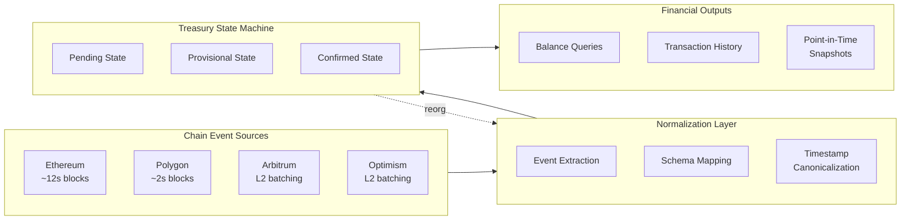

export const frontmatter = {
  title: "Multi-Chain Treasury Infrastructure for Crypto Organizations",
  slug: "multi-chain-treasury",
  date: "2026-01-31",
  status: "published",
  tags: ["crypto", "treasury", "multi-chain", "evm", "fintech", "distributed-systems"]
}

# Multi-Chain Treasury Infrastructure for Crypto Organizations

## The Problem at Scale

When a crypto organization grows past a handful of wallets on a single chain, treasury operations become a coordination nightmare.

At Coinshift, we saw this pattern repeatedly across the 300+ organizations using the platform—from major DAOs managing protocol treasuries to leading DeFi protocols with assets scattered across Ethereum, Polygon, Arbitrum, Optimism, and a half-dozen other chains. The finance teams were drowning.

A typical organization might have: a main treasury Safe on Ethereum, operational funds on Polygon for lower gas costs, grants distributed on Arbitrum, and token holdings on whatever chain their protocol deployed to. Each chain required separate tools. Balances lived in different block explorers. Transaction history existed in fragments. When the CFO asked "what's our total position?" the answer required hours of manual spreadsheet work.

This wasn't a UI problem or a wallet problem. It was a fundamental data consistency and financial modeling problem. And the infrastructure to solve it didn't exist.

---

## Why Standard Approaches Fail

Organizations tried several approaches before landing on our platform. Each failed in predictable ways.

### Per-Chain Ledgers with Manual Reconciliation

The first instinct is to treat each chain as a separate ledger and reconcile monthly. Finance teams would export CSV files from block explorers, map addresses to internal account codes, and manually aggregate.

This breaks down immediately at scale. A single active Safe might have hundreds of transactions per month. Across multiple chains, multiple Safes, and multiple token types, the reconciliation burden becomes unsustainable. Worse, errors compound—a missed transaction on one chain propagates through the entire reporting process.

### Unified Schema with Chain-Specific Adapters

The next attempt is building a unified database schema with adapters that normalize each chain's data model. Transaction timestamps, block numbers, and event structures get mapped to common fields.

This works for simple cases but fails on edge cases that matter for financial accuracy. Chains have different timestamp semantics—some use block timestamps, others use different epoch definitions. Reorgs happen at different depths with different probabilities. Token standards have subtle variations (ERC-20 vs. chain-specific extensions). The adapter approach creates a false sense of uniformity that breaks when you need precise financial state.

### Snapshot-Based State

Some organizations attempt point-in-time snapshots—daily or weekly captures of balances across all chains. Reporting then uses the nearest snapshot.

This fails the first time an auditor asks for state at a specific timestamp that doesn't align with your snapshot schedule. It also can't handle streaming payments, which require continuous balance awareness. And it creates a massive storage burden while still missing the granularity needed for accurate accounting.

---

## The Architecture We Built

After iterating through these failure modes, we built an event-sourced treasury state system with three core properties.

### Event-Sourced Financial State

Every balance change, every transaction, every protocol interaction is captured as an immutable event. Treasury state is computed by replaying events, not by querying snapshots.

This matters because audits require deterministic historical reconstruction. When an auditor asks "what was the balance of this Safe at 3:47 PM UTC on March 15th?"—we can replay events up to that timestamp and produce the exact state. Not an approximation. The exact state, reproducible from the event log.

### Cross-Chain Transaction Normalization

Each chain's transaction model gets normalized into a common financial transaction schema. But critically, we preserve the original chain-specific data—normalization is a view layer, not a lossy transformation.

A swap on Uniswap (Ethereum), a swap on QuickSwap (Polygon), and a swap on SushiSwap (Arbitrum) all become "swap" transactions with consistent semantics. But the underlying event data—contract addresses, log indices, block contexts—remains accessible for chain-specific queries or debugging.

### Confirmation-Aware State Machine

Transactions exist in multiple states: pending, seen, likely-final, confirmed. Different downstream systems subscribe to different finality thresholds.

The treasury dashboard might show a transaction as soon as it's seen—users expect immediate feedback. The accounting system waits for confirmed status before generating ledger entries. The audit trail includes the full state history, showing when a transaction moved through each confirmation stage.

---

## Architectural Decisions

| Decision | Alternatives Considered | Why This Choice |
|----------|------------------------|-----------------|
| Event-sourced state | Snapshot-based, CQRS without full event log | Audits require deterministic historical reconstruction; snapshots can't provide arbitrary point-in-time queries |
| Preserve raw chain data alongside normalized views | Normalize and discard original | Debugging and compliance require access to original chain semantics |
| Confirmation-depth state machine | Binary confirmed/unconfirmed | Different use cases have different finality requirements; single threshold is too restrictive |
| Streaming payments as first-class primitives | Model as discrete transaction series | Sablier/Superfluid integrations require continuous balance awareness |
| Chain-agnostic timestamp canonicalization | Use block timestamps directly | Block times vary by chain; cross-chain queries need consistent time domain |

---

## Hard Problem Deep Dives

### Chain Reorg Handling for Financial State

Chain reorgs are the nightmare scenario for financial infrastructure. A transaction that appeared confirmed gets invalidated. Downstream systems that processed that transaction—payment marked complete, accounting entry generated, notification sent—now have inconsistent state.

Most systems ignore this because reorgs are rare. On Ethereum mainnet, reorgs deeper than a few blocks are extremely rare. But "extremely rare" isn't "never," and when you're managing $1B+ in assets for 300+ organizations, rare events become statistical certainties over time.

Our approach: transactions don't exist in a binary confirmed/unconfirmed state. They have confirmation depth, and that depth can decrease. The state machine tracks the highest confirmation depth achieved and the current depth. When a reorg occurs, affected transactions get rolled back to their pre-reorg depth, and any downstream state derived from those transactions gets marked for recomputation.

The tricky part is downstream propagation. If a confirmed transaction generated an accounting entry, and then the transaction reorgs, what happens to the accounting entry? We maintain causal links between derived state and source events. Reorg events trigger cascading recomputation of derived state. The system converges to consistency automatically.

### Cross-Chain Balance Determinism

"What is the balance?" seems like a simple question. It isn't when assets span multiple chains with different finality guarantees.

On Ethereum, a transaction in block N has ~12 second finality in the happy path, but probabilistic finality means there's always some chance of reorg. On Polygon, blocks are faster but the security model is different. On L2s, transactions might be batched with timestamps that differ from when they actually settle on L1.

We needed consistent snapshot semantics across heterogeneous finality models. The solution: a canonical timestamp domain that's chain-agnostic, combined with chain-specific finality mappings. When you query "balance at time T," the system translates T into the appropriate block range for each chain, applies the confirmation-depth threshold you specified, and aggregates.

This means cross-chain balance queries are reproducible. The same query with the same parameters produces the same result, regardless of when you run it (assuming no reorgs have occurred). That property—query reproducibility—is what makes audit possible.

### Streaming Payment State Management

Streaming payments broke our initial transaction model completely.

Protocols like Sablier and Superfluid enable continuous payment streams—salary paid per-second, vesting released linearly over months. These aren't discrete transactions. They're continuous functions of time. But accounting systems expect discrete entries.

We built a dual representation. The treasury state layer understands streams natively—balance calculations incorporate accrued stream amounts based on the query timestamp. A salary stream that pays 1 ETH over 30 days contributes the appropriate fraction to the balance at any moment.

The accounting layer generates discrete events from continuous streams at configurable intervals. End of day, end of month, whenever the organization's accounting practices require. The continuous reality and discrete representation coexist, reconcilable but serving different purposes.

---

## Multi-Chain State Aggregation

---

## Production Outcomes

### Technical Outcomes
- Unified treasury state across 10+ EVM chains
- Deterministic historical reconstruction for any timestamp
- Sub-second balance queries across all managed wallets
- Automatic reorg detection and state recovery
- Native streaming payment support (Sablier, Superfluid integration)

### Operational Outcomes
- Eliminated manual cross-chain reconciliation—finance teams stopped spending days on monthly close
- Real-time treasury visibility—CFOs could answer "what's our position?" instantly instead of after hours of spreadsheet work
- Simplified multi-sig operations—batch payments across chains from a single interface

### Business Outcomes
- Enabled institutional treasury workflows that simply weren't possible before
- Audit readiness—when auditors asked for historical state, we could produce it deterministically
- Supported organizational growth—teams could add chains without adding reconciliation burden

---

## Scale Context

This infrastructure operates at meaningful scale:
- $1B+ in managed Safe accounts
- 300+ organizations relying on it for daily treasury operations
- 10+ EVM networks with unified state
- Major DAOs and leading protocols among active users

---

## Lessons Learned

**Multi-chain is primarily a data consistency problem, not a UI problem.** The user interface for multi-chain treasury is straightforward—show balances, show transactions, enable payments. The hard part is making those numbers correct and consistent across chains with different data models, timing, and finality.

**Event sourcing isn't optional for financial systems.** Any architecture that relies on snapshots or mutable state will eventually fail an audit. The ability to replay history deterministically is the foundation everything else rests on.

**Design for reorgs from the start.** Adding reorg handling to a system that assumed transactions are permanent is nearly impossible. The confirmation-depth model has to be baked in from the beginning.

**Streaming payments are the future.** More protocols are adopting continuous payment models. Treasury infrastructure that can only handle discrete transactions will become increasingly inadequate.

---

## Related Technical Deep Dives

For how raw blockchain data becomes financial data:
- **[[Multi-Chain Blockchain Data Indexing and Analytics Infrastructure]]**

For how assets are valued for reporting:
- **[[Accurate Multi-Source Crypto Pricing Infrastructure for Accounting and Financial Reporting]]**

For the security architecture protecting this infrastructure:
- **[[Banking-Grade Security Architecture for Web3 Financial Infrastructure]]**

For the broader system context:
- **[[Unified Crypto Financial Infrastructure — Treasury, Pricing, and Multi-Chain Data Systems]]**
