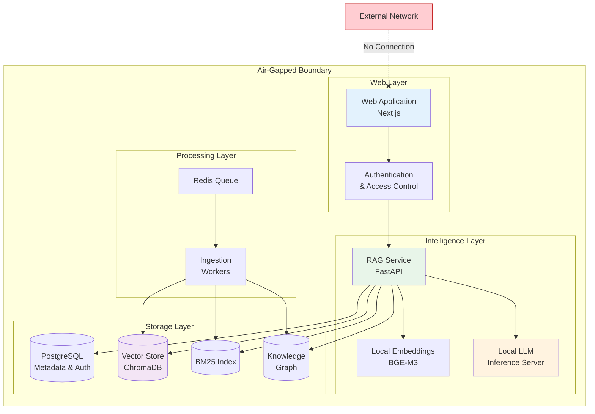

export const frontmatter = {
  title: "Offline Secure Document Intelligence Platform for Air-Gapped Environments",
  slug: "offline-document-ai",
  date: "2025-12-16",
  status: "published",
  tags: ["offline-ai", "rag", "secure-ai", "defense", "airgapped", "document-intelligence"],
  industry: "defense / aerospace / regulated industries",
  domain: "secure AI infrastructure",
  tech: "local llm, vector db, hybrid retrieval, microservices"
}

# Offline Secure Document Intelligence Platform for Air-Gapped Environments

## The Engagement

A defense contractor approached us with a challenge that seemed straightforward until you understood the constraints. They had thousands of restricted technical manuals—engineering specifications, maintenance procedures, system documentation—and their engineers were drowning in manual search. Finding the right procedure meant opening multiple PDFs, searching each one individually, and hoping you remembered which document contained the information you needed.

Every AI vendor they talked to had the same pitch: upload your documents to our cloud platform, let our models index them, and enjoy intelligent search. The sales calls ended the same way every time—when the contractor explained that these documents could not leave their secured network, could not touch external infrastructure, and could not transmit data to any third-party system, the vendors had nothing to offer.

The documents were classified. The network was air-gapped. And "policy-based security"—where cloud providers promise to keep your data safe through contractual agreements and configuration settings—was not an acceptable answer for their compliance requirements.

They needed AI-powered document intelligence, but they needed it to run entirely within their controlled infrastructure, with zero external dependencies. Not "configurable for air-gapped deployment." Not "private cloud option available." Actually, architecturally, incapable of communicating with external systems.

---

## What They Needed

The requirements were defined by their operational environment more than by feature preferences:

**Zero external network dependency for core functionality.** The system must operate with no internet access whatsoever. This isn't a "fallback mode"—it's the primary operating condition. Network connections to external systems should be architecturally impossible, not just disabled by configuration.

**All AI inference must run on local infrastructure.** Embedding generation, language model inference, speech recognition—every AI capability must execute on hardware they control, within their secured environment. No API calls to external model providers under any circumstances.

**Operation through network segmentation and intermittent connectivity.** Even within their internal network, connectivity between segments could be restricted or intermittent. The system needed to function in partially connected states, not just fully connected or fully offline.

**Complete audit trail for every query and document access.** Every search, every document retrieval, every conversation must be logged and auditable. Their compliance requirements demanded visibility into exactly what information was accessed, by whom, and when.

**Hardware-constrained deployment.** The available compute infrastructure was not a hyperscale data center. The system needed to run efficiently on the hardware they could actually deploy in a secured environment—meaningful constraints on memory, GPU availability, and storage.

---

## The Technical Solution

We built a document intelligence platform designed from the ground up for offline operation—not adapted from a cloud architecture, but natively offline.

The diagram above shows the complete system deployed within the air-gapped boundary. Every component—web interface, AI inference, embeddings, storage—runs locally with no external network path. The crossed connection to external networks represents the architectural impossibility of data egress.

### Offline-First, Not Offline-Capable

This distinction matters. Most enterprise AI platforms are designed for cloud deployment and then modified to support "offline mode" as a fallback. The architecture assumes cloud connectivity and degrades when it's unavailable.

We designed in the opposite direction. The platform assumes no external connectivity and requires no modification to run in air-gapped environments. Every component—document parsing, embedding generation, vector storage, language model inference, search, and conversation—runs locally.

We considered a hybrid approach with optional cloud connectivity. But hybrid architectures create ambiguity. Which queries go to the cloud? What happens when cloud connectivity is available for some operations but not others? For their security model, ambiguity was unacceptable. The system needed to be architecturally simple: nothing leaves the controlled environment.

### Local LLM Inference

The most significant architectural decision was running large language model inference entirely on local infrastructure.

We considered cloud API access through a secured VPN tunnel. This is a common "compromise" architecture—documents stay local, but inference calls go to external APIs through an encrypted connection. For their requirements, this was a non-starter. VPNs are policy-based security. The network could be misconfigured. The VPN could fail open. Their compliance requirements demanded architectural guarantees, not network configuration.

We implemented local LLM inference using optimized open-weight models. This required careful selection of models that could run efficiently on their available hardware while maintaining sufficient capability for technical documentation tasks. The models run through a local inference server with no network listener on external interfaces.

### Worker-Based Horizontal Scaling

Document ingestion and embedding generation are computationally intensive. The system needed to handle bulk document imports without blocking interactive queries.

We considered vertical scaling—bigger hardware with more resources. But in secured environments, hardware procurement is constrained. They couldn't simply requisition more powerful machines when the workload grew.

We considered serverless-style scaling. But serverless architectures typically depend on cloud orchestration. More importantly, they have cold start latency—the first request after idle spins up a new instance. For their operational requirements, predictable response times mattered more than maximum throughput.

We implemented Redis-queue-backed worker processes. Document ingestion jobs queue asynchronously while retrieval queries execute immediately. Workers can be scaled horizontally by adding more processes on available hardware. The system provides predictable latency characteristics because query processing doesn't compete with background ingestion work.

### Custom Chunking for Technical Documents

Standard document chunking—splitting text at fixed token limits—fragments technical documentation in ways that destroy context. A safety procedure split mid-sentence loses its meaning. A troubleshooting flowchart with the condition separated from the action becomes useless.

We implemented custom chunkers that respect semantic boundaries in technical documents. This required understanding the structure of their documentation formats: S1000D XML with hierarchical sections, PDF manuals with implicit structure encoded in formatting, and procedural documents with step-by-step logic.

The chunking system detects section boundaries, procedural breaks, and semantic units. It produces chunks that maintain internal coherence rather than arbitrary text spans.

---

## Hard Problems We Navigated

### Model Performance vs. Hardware Constraints

Embedding generation and language model inference are computationally expensive. Cloud deployments can throw hardware at this problem—GPU clusters, optimized inference infrastructure, automatic scaling. A secured on-premises deployment cannot.

We invested significant effort in optimization. Embedding batch sizes were tuned to maximize throughput without exceeding available memory. Model quantization reduced memory requirements while maintaining acceptable quality for technical documentation tasks. Inference paths were optimized to minimize unnecessary computation.

This required iterative testing with their actual hardware. Theoretical performance projections were insufficient—we needed to verify that document ingestion would complete in acceptable time, that query latency would meet requirements, and that the system would remain stable under sustained load.

### Semantic Boundary Detection in Technical Documents

Technical documentation follows conventions that differ from general prose. A maintenance procedure has numbered steps. A troubleshooting guide has decision trees. A parts catalog has structured entries. Standard text segmentation tools don't understand these conventions.

We built parsing pipelines that understand technical document structure. For S1000D XML, this meant following the specification's semantic elements. For PDF documents, this meant inferring structure from formatting cues—heading fonts, numbered lists, indentation patterns.

The goal was chunks that a human would recognize as complete units of information. A technician searching for a procedure should find the complete procedure, not fragments that happen to contain keywords.

### Hybrid Score Balancing Without Cloud-Scale Calibration

The same score normalization challenge from our hybrid retrieval architecture appeared here—combining semantic, lexical, and graph-based retrieval scores requires calibration.

In a cloud deployment, you can accumulate query logs at scale and continuously refine your normalization parameters. In an air-gapped environment, you have only the queries that occur within that environment, and you cannot easily export anonymized query patterns for external analysis.

We implemented local calibration strategies. During initial deployment, we worked with their engineering team to develop representative query sets across their documentation domains. These queries—along with human relevance judgments—formed the calibration dataset for score normalization.

The system also includes feedback mechanisms for ongoing refinement. When users indicate that results were helpful or not, that signal feeds back into calibration. This allows the system to improve over time without requiring external data or connectivity.

---

## Tradeoffs We Made

**Model capability for deployability.** The largest, most capable language models require hardware resources that may not be available in secured environments. We selected models that balanced capability against realistic deployment constraints. This means the system may not match the performance of frontier cloud models on general tasks—but it runs where they cannot.

**Feature scope for architectural simplicity.** Some capabilities that are straightforward in cloud-connected systems—automatic model updates, continuous learning from aggregated user behavior, integration with external knowledge sources—are not possible in an air-gapped deployment. We scoped the system to deliver core document intelligence capabilities reliably rather than attempting features that would compromise the security model.

**Development velocity for deployment confidence.** Every component required verification that it truly had no external dependencies. Libraries that make hidden network calls, models that phone home for telemetry, logging systems that try to reach external servers—all had to be identified and replaced or reconfigured. This slowed development but was necessary for deployment confidence.

---

## What Shipped

The platform deployed to their secured environment supporting their technical documentation library.

### Technical Outcomes

Full document intelligence capability operates with zero external dependencies. Semantic search, conversational Q&A, and multi-document reasoning all function entirely within the controlled network.

The system operates through network segmentation. When internal connectivity is constrained, the system continues functioning with whatever documents and indices are locally available.

All operations are auditable. Compliance teams can review complete logs of document access and query patterns.

### Business Outcomes

AI-powered document intelligence became available in an environment where cloud AI was categorically impossible. Their engineers can now search technical documentation using natural language and receive contextually relevant results—capability that was previously unavailable due to security requirements.

Manual document search time decreased substantially. Engineers who previously spent significant time locating correct procedures now find them in seconds.

Compliance posture was maintained. The architecture provides the security guarantees their compliance requirements demanded—not through policy or configuration, but through system design.

---

## Lessons From This Work

Offline-first design is fundamentally different from offline-capable design. Systems designed for cloud deployment and adapted for offline use carry architectural assumptions that create friction, failure modes, and security risks. True offline systems must be designed from the ground up with that constraint as a primary requirement.

Security through architecture is stronger than security through policy. Configurations can be changed. Policies can have exceptions. Architectures that simply cannot make external calls provide stronger guarantees than systems that promise not to.

Hardware constraints are real in secured environments. Cloud-native thinking assumes elastic compute and storage. Secured deployments operate with fixed, often limited, hardware. System design must account for these constraints from the beginning, not as an afterthought.

---

## Where This Approach Applies

This architecture pattern is relevant for organizations operating under similar constraints:

- Defense and intelligence organizations with classified documentation
- Government agencies with data sovereignty requirements
- Aerospace and defense contractors with ITAR/export-controlled content
- Critical infrastructure operators with air-gapped operational technology networks
- Research organizations with sensitive intellectual property

If your security requirements demand architectural guarantees rather than policy-based controls, if your documents cannot leave controlled infrastructure under any circumstances, and if you need AI capability despite these constraints—an offline-first architecture is the approach that works.
