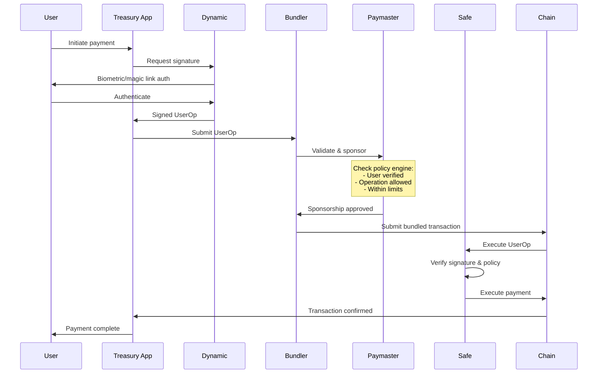

export const frontmatter = {
  title: "Smart Wallet Infrastructure with Gas Abstraction and Passwordless Authentication",
  slug: "smart-wallet",
  date: "2026-01-31",
  status: "published",
  tags: ["smart-wallet", "account-abstraction", "web3-ux", "crypto-infra", "authentication", "gas-abstraction"]
}

# Smart Wallet Infrastructure with Gas Abstraction and Passwordless Authentication

## The Problem at Scale

Wallet UX is the silent killer of crypto adoption.

At Coinshift, we watched this play out in real-time. Organizations would sign up for our treasury platform, go through onboarding, and then hit the same wall: the person responsible for managing treasury wasn't comfortable with seed phrases. Or they couldn't figure out why they needed to hold ETH to move USDC. Or the multi-sig coordination for approvals was so operationally complex that it took longer to approve a payment than to do it manually in a bank.

We were building treasury infrastructure for 300+ organizations managing $1B+ in assets. These weren't crypto-native developers who grew up with MetaMask. They were finance professionals, operations managers, grant coordinators—people who needed to do their job, not learn blockchain infrastructure.

The standard Web3 wallet experience—install MetaMask, save your seed phrase, acquire gas tokens, understand transaction signing—filtered out exactly the people we needed to reach. We had to build something different.

---

## Why Standard Approaches Fail

### Traditional EOA + Multi-sig

The original approach: each user has an Externally Owned Account (EOA) with their own private key. For organizational treasuries, use a multi-sig like Gnosis Safe requiring N-of-M signatures to execute transactions.

The UX problems cascade:

**Seed phrase anxiety.** Most users have heard horror stories about lost keys and stolen funds. Asking a finance manager to write down 12 words that control organizational assets creates legitimate fear. Many refuse, others write it down insecurely.

**Gas token requirement.** Every user needs ETH (or the native gas token) to sign transactions. They're approving a USDC payment, but first they need to acquire ETH. This creates an onboarding cliff that kills conversion.

**Multi-sig coordination overhead.** A payment requires signatures from multiple parties. Each signer needs to be online, connected to the right wallet, with sufficient gas. Coordinating this for routine payments is operationally exhausting.

### Standard EOA with Gas Sponsorship

Some platforms try to solve the gas problem by sponsoring transactions—the platform pays gas on behalf of users.

This helps but doesn't solve the fundamental issues. Users still need seed phrases. Multi-sig coordination is still complex. And gas sponsorship opens abuse vectors—what stops someone from using your sponsored infrastructure to spam transactions?

The approach also doesn't work for organizations where the finance team member approving payments isn't the same person who set up the wallet.

### Custodial Solutions

The ultimate UX simplification: give up self-custody. Users authenticate with email, the platform holds keys.

This defeats the purpose for treasury use cases. DAOs and crypto organizations choose on-chain treasury management specifically to avoid custodial risk. A custodial solution is a non-starter for organizations whose entire governance model depends on trustless execution.

---

## The Architecture We Built

We rebuilt the wallet interaction model from the ground up, using account abstraction primitives to eliminate seed phrases, abstract gas, and maintain self-custody.

### Passwordless Authentication with Dynamic

Users authenticate via email or social login, not seed phrases. We integrated [Dynamic](https://www.dynamic.xyz/) to handle the authentication flow:

- User enters email, receives a magic link
- Dynamic manages the embedded wallet creation and key material
- The wallet is associated with the user's identity, not a seed phrase they control directly

This seems like custodial—but it's not. The key material is derived from the user's authentication credentials through a non-custodial embedded wallet model. Dynamic doesn't have access to keys. We don't have access to keys. But the user doesn't need to manage a seed phrase.

The tradeoff: users trust Dynamic's infrastructure for key derivation. We evaluated this carefully—for treasury use cases, the risk of seed phrase mismanagement exceeded the risk of embedded wallet infrastructure.

### Gas Abstraction via Paymasters

Users never need to hold gas tokens. When a user initiates a transaction, the system:

1. Wraps the transaction in an ERC-4337 UserOperation
2. Routes it through a Bundler that batches UserOps
3. The Paymaster (our infrastructure) pays gas fees
4. The transaction executes without the user holding native tokens

From the user's perspective: they click "approve payment" and the payment happens. The underlying gas mechanics are invisible.

### Safe Smart Account Integration

User accounts are smart contract wallets (Safes), not EOAs. This enables:

- Multi-sig policies at the contract level, not the client level
- Flexible ownership models (add/remove signers without changing address)
- Transaction batching (multiple operations in one transaction)
- Session keys for routine operations

The Safe is the source of truth for authorization. The embedded wallet from Dynamic controls a key that can sign for the Safe, but the Safe's policies determine what that key can do.

---

## Architectural Decisions

| Decision | Alternatives Considered | Why This Choice |
|----------|------------------------|-----------------|
| Embedded wallet via Dynamic | Traditional EOA, full custodial | Eliminates seed phrase requirement while maintaining non-custodial model |
| Gas abstraction via ERC-4337 paymaster | Native gas sponsorship, meta-transactions | Standard account abstraction approach; works across chains with ERC-4337 support |
| Safe smart accounts | EOA-only, custom smart wallet | Safe is battle-tested with billions in TVL; extensible via modules |
| Session keys for routine operations | Full signing for every action | Better UX for frequent operations without sacrificing security |
| Policy engine for gas sponsorship | Open sponsorship, allowlist only | Prevents abuse while allowing legitimate operations |

---

## Hard Problem Deep Dives

### Gas Sponsorship Abuse Prevention

Open gas sponsorship creates an attack surface. If anyone can execute transactions on your sponsored infrastructure, what stops:
- Spammers using your infra to flood networks
- Attackers executing malicious transactions with your gas
- Competitors draining your sponsorship budget

We built a policy engine that gates sponsorship:

**User identity verification.** Only authenticated users with verified accounts can sponsor transactions. Anonymous or unverified addresses get rejected.

**Operation allowlisting.** The paymaster validates that the operation matches allowed patterns—transfers within the treasury platform, Safe management operations, approved integrations. Arbitrary contract calls get rejected.

**Rate limiting.** Per-user and per-organization limits on sponsored operations. Legitimate treasury operations fit within reasonable bounds; abuse attempts hit limits quickly.

**Value bounds.** Sponsored operations have value limits appropriate to the use case. A treasury payment within normal operational bounds gets sponsored. An attempt to drain a wallet in one transaction gets flagged.

The policy engine operates at the Bundler level before transactions are submitted to the Paymaster, so rejected operations never cost gas.

### Recovery Model Without Seed Phrases

Passwordless auth creates a recovery problem. Traditional wallets: lose your seed phrase, lose access. What happens when users lose access to their email?

We built a multi-path recovery model:

**Email recovery.** Primary path—users authenticate via email, recover access through email verification. Standard password reset flow conceptually.

**Social recovery.** For high-value accounts, configure guardians who can authorize recovery. Guardians are other authenticated users (team members, trusted contacts) who can collectively approve account recovery without individually having access.

**Device-based recovery.** If the user has multiple authenticated devices, recovery can be authorized from an existing session.

**Emergency admin recovery.** For organizational accounts, designated administrators can trigger recovery processes through enhanced verification.

The key insight: seed phrases are a recovery mechanism. We replaced them with multiple recovery paths that don't require users to manage cryptographic material directly.

### Session Key Security Boundaries

Session keys improve UX by allowing pre-authorized operations without per-transaction signing. A user authorizes "transfers up to $1000 to payroll recipients" and subsequent payroll operations execute automatically.

This expands the attack surface. A compromised session key can execute whatever operations were authorized.

We implemented strict boundaries:

**Scoped permissions.** Session keys authorize specific operation types to specific recipients with specific limits. A session key for payroll can't approve a governance vote.

**Time expiration.** Session keys expire. Default expiration is 24 hours; high-value authorizations expire faster.

**Revocation.** Session keys can be revoked immediately if compromise is suspected. Revocation is a Safe-level operation that invalidates the session across all bundlers.

**Audit logging.** Every session key operation is logged with full context—what was authorized, what was executed, when, from what device.

The permission model maps to organizational roles. A routine operations role might have session keys for standard payments. An administrator role requires per-transaction signing.

---

## Transaction Flow with Gas Abstraction

---

## Production Outcomes

### Technical Outcomes
- Passwordless authentication with non-custodial key management
- Gas abstraction eliminating native token requirements
- Session key infrastructure for routine operations
- Multi-path recovery model without seed phrase dependency

### Operational Outcomes
- Dramatic reduction in onboarding support tickets—users no longer stuck on seed phrase or gas acquisition steps
- Faster transaction approval cycles—multi-sig coordination simplified
- Reduced user errors—no more gas estimation failures or insufficient balance issues

### Business Outcomes
- Improved onboarding conversion—finance professionals who previously bounced now complete setup
- Reduced churn from UX friction—treasury operations actually usable by non-crypto-native staff
- Broader organizational adoption—not limited to users comfortable with traditional wallet UX

---

## Scale Context

- Platform serving 300+ organizations
- $1B+ in assets under management with this wallet infrastructure
- Thousands of gas-abstracted transactions processed
- Major DAOs and leading protocols using the platform
- Finance professionals, not just crypto natives, as primary users

---

## Lessons Learned

**Wallet UX problems are transaction orchestration problems, not UI problems.** Making buttons prettier doesn't help if users still need to understand gas and seed phrases. The abstraction has to be architectural.

**Non-custodial doesn't require seed phrases.** The crypto community conflates self-custody with direct key management. Embedded wallets with proper key derivation provide self-custody without exposing users to key management complexity.

**Gas abstraction requires abuse prevention from day one.** Sponsoring gas is easy. Sponsoring only legitimate operations while blocking abuse is the actual engineering problem.

**Recovery model design is as important as primary auth.** Users will lose access. If recovery is worse than the problem you're solving (seed phrases), you haven't improved anything.

**Session keys are powerful but dangerous.** The convenience gain has to be balanced against the security surface expansion. Scoped permissions, time bounds, and auditability are non-negotiable.

---

## Related Technical Deep Dives

For how smart wallet infrastructure integrates with treasury operations:
- **[[Multi-Chain Treasury Infrastructure for Crypto Organizations]]**

For the security architecture protecting wallet infrastructure:
- **[[Banking-Grade Security Architecture for Web3 Financial Infrastructure]]**

For the broader system context:
- **[[Unified Crypto Financial Infrastructure — Treasury, Pricing, and Multi-Chain Data Systems]]**
